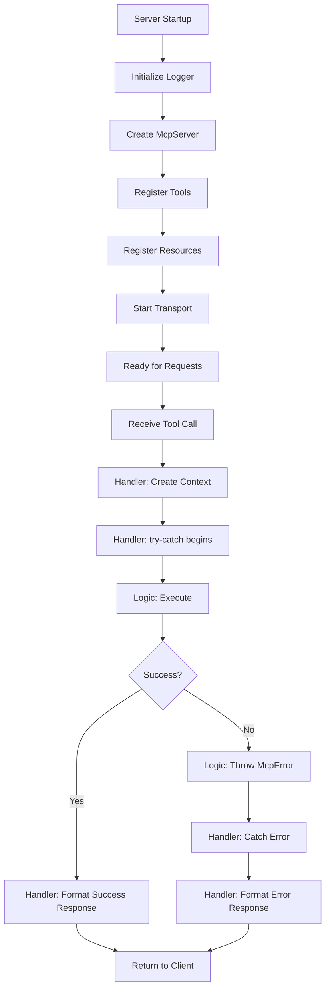

# IBM i MCP Server - Developer Guide

A comprehensive guide for developers working with the IBM i MCP Server. This guide covers setup, configuration, testing, SQL tools, agent development, and best practices.

---
</div>

<details>
<summary><strong>📋 Table of Contents</strong></summary>

- [IBM i MCP Server - Developer Guide](#ibm-i-mcp-server---developer-guide)
  - [Quick Start](#quick-start)
    - [Prerequisites](#prerequisites)
    - [Installation](#installation)
    - [Initial Configuration](#initial-configuration)
  - [Server Setup \& Configuration](#server-setup--configuration)
    - [Environment Variables](#environment-variables)
    - [Transport Modes](#transport-modes)
    - [Authentication Setup](#authentication-setup)
  - [Starting the Server](#starting-the-server)
    - [Development Mode](#development-mode)
    - [Production Mode](#production-mode)
    - [CLI Options](#cli-options)
  - [Testing the Server](#testing-the-server)
    - [Running Unit Tests](#running-unit-tests)
    - [Using MCP Inspector](#using-mcp-inspector)
    - [Testing with Authentication](#testing-with-authentication)
  - [SQL Tools](#sql-tools)
    - [YAML Configuration](#yaml-configuration)
      - [File Structure](#file-structure)
      - [Sources Section](#sources-section)
      - [Tools Section](#tools-section)
      - [Toolsets Section](#toolsets-section)
    - [Tool Schemas](#tool-schemas)
      - [Parameter Types](#parameter-types)
      - [Parameter Constraints](#parameter-constraints)
      - [SQL Statement Patterns](#sql-statement-patterns)
      - [Security Configuration](#security-configuration)
    - [Best Practices](#best-practices)
      - [Complete Example](#complete-example)
  - [Agent Development](#agent-development)
    - [Simple MCP Client](#simple-mcp-client)
    - [Agent Frameworks](#agent-frameworks)
      - [Agno (AgentOS)](#agno-agentos)
      - [Building Agents with Unique Toolsets](#building-agents-with-unique-toolsets)
      - [Agent UI](#agent-ui)
    - [Example Agents](#example-agents)
  - [Architecture \& Patterns](#architecture--patterns)
    - [Core Principles](#core-principles)
    - [File Structure](#file-structure-1)
    - [Creating New Tools](#creating-new-tools)
  - [Troubleshooting](#troubleshooting)
  - [Additional Resources](#additional-resources)

</details>

---

## Quick Start

### Prerequisites

| Requirement | Version | Installation |
|------------|---------|--------------|
| **Node.js** | ≥20.0.0 | [nodejs.org](https://nodejs.org) |
| **npm** | Latest | Included with Node.js |
| **IBM i System** | OS 7.3+ | Access to Db2 for i |
| **Mapepire Daemon** | Latest | Running on IBM i |

<details>
<summary><strong>Optional Tools</strong></summary>

- **Python 3.12+** - For agent development
- **uv** - Python package manager for agents
- **Docker/Podman** - For containerized deployment
- **Git** - Version control

</details>

### Installation

```bash
# Clone the repository
git clone https://github.com/IBM/ibmi-mcp-server.git
cd ibmi-mcp-server/

# Install dependencies
npm install

# Build the project
npm run build
```

### Initial Configuration

1. **Create Environment File**
   ```bash
   cp .env.example .env
   ```

2. **Configure IBM i Connection**

   Edit `.env` and set your IBM i connection details:
   ```ini
   DB2i_HOST=your-ibmi-hostname
   DB2i_USER=your-username
   DB2i_PASS=your-password
   DB2i_PORT=8076
   DB2i_IGNORE_UNAUTHORIZED=true
   ```

3. **Verify Setup**
   ```bash
   npm run start:stdio
   ```

---

## Server Setup & Configuration

### Environment Variables

The server is configured through environment variables in the `.env` file:

<details open>
<summary><strong>Core Server Configuration</strong></summary>

| Variable | Default | Description |
|----------|---------|-------------|
| `MCP_TRANSPORT_TYPE` | `stdio` | Transport mode: `stdio` or `http` |
| `MCP_SESSION_MODE` | `auto` | Session handling: `stateless`, `stateful`, `auto` |
| `MCP_LOG_LEVEL` | `debug` | Log verbosity: `debug`, `info`, `warning`, `error` |
| `LOGS_DIR` | `logs/` | Directory for log files |

</details>

<details>
<summary><strong>Database Configuration</strong></summary>

| Variable | Default | Description |
|----------|---------|-------------|
| `DB2i_HOST` | — | IBM i hostname or IP address |
| `DB2i_USER` | — | IBM i user profile |
| `DB2i_PASS` | — | User password |
| `DB2i_PORT` | `8076` | Mapepire daemon port |
| `DB2i_IGNORE_UNAUTHORIZED` | `true` | Skip TLS verification (dev only) |

</details>

<details>
<summary><strong>HTTP Transport Configuration</strong></summary>

| Variable | Default | Description |
|----------|---------|-------------|
| `MCP_HTTP_HOST` | `127.0.0.1` | HTTP server bind address |
| `MCP_HTTP_PORT` | `3010` | HTTP server port |
| `MCP_ALLOWED_ORIGINS` | — | CORS allowed origins (comma-separated) |

</details>

<details>
<summary><strong>SQL Tools Configuration</strong></summary>

| Variable | Default | Description |
|----------|---------|-------------|
| `TOOLS_YAML_PATH` | `tools` | Path to YAML tool definitions |
| `YAML_MERGE_ARRAYS` | `true` | Merge arrays when combining YAMLs |
| `YAML_AUTO_RELOAD` | `true` | Auto-reload on YAML file changes |
| `YAML_ALLOW_DUPLICATE_TOOLS` | `false` | Allow duplicate tool names |
| `YAML_VALIDATE_MERGED` | `true` | Validate merged configurations |
| `SELECTED_TOOLSETS` | — | Load specific toolsets only |

</details>

<details>
<summary><strong>Authentication Configuration</strong></summary>

| Variable | Default | Description |
|----------|---------|-------------|
| `MCP_AUTH_MODE` | `none` | Auth mode: `none`, `jwt`, `oauth`, `ibmi` |
| `MCP_AUTH_SECRET_KEY` | — | JWT signing secret (≥32 chars) |
| `IBMI_HTTP_AUTH_ENABLED` | `false` | Enable IBM i HTTP auth endpoints |
| `IBMI_AUTH_ALLOW_HTTP` | `false` | Allow HTTP (dev only, use HTTPS in prod) |
| `IBMI_AUTH_TOKEN_EXPIRY_SECONDS` | `3600` | Token lifetime (1 hour) |
| `IBMI_AUTH_KEY_ID` | `development` | Key identifier for rotation |
| `IBMI_AUTH_PRIVATE_KEY_PATH` | `secrets/private.pem` | Path to RSA private key |
| `IBMI_AUTH_PUBLIC_KEY_PATH` | `secrets/public.pem` | Path to RSA public key |

</details>

### Transport Modes

The server supports two transport mechanisms:

| Transport | Use Case | Configuration |
|-----------|----------|---------------|
| **stdio** | CLI tools, MCP Inspector, local development | `MCP_TRANSPORT_TYPE=stdio` |
| **http** | Web clients, distributed agents, production | `MCP_TRANSPORT_TYPE=http` |

**Session Modes (HTTP Only)**

| Mode | Behavior | Best For |
|------|----------|----------|
| `stateless` | No session persistence | Stateless services, load balancing |
| `stateful` | Persistent sessions | Complex multi-step workflows |
| `auto` | Auto-detect client capabilities | General use (recommended) |

### Authentication Setup

<details>
<summary><strong>IBM i HTTP Authentication (Recommended)</strong></summary>

IBM i HTTP authentication provides secure, token-based access with per-user connection pooling.

**1. Generate RSA Keypair**

```bash
mkdir -p secrets
openssl genpkey -algorithm RSA -out secrets/private.pem -pkeyopt rsa_keygen_bits:2048
openssl rsa -pubout -in secrets/private.pem -out secrets/public.pem
```

**2. Configure Environment**

```ini
# Enable IBM i authentication
MCP_AUTH_MODE=ibmi
IBMI_HTTP_AUTH_ENABLED=true

# Key configuration
IBMI_AUTH_KEY_ID=development
IBMI_AUTH_PRIVATE_KEY_PATH=secrets/private.pem
IBMI_AUTH_PUBLIC_KEY_PATH=secrets/public.pem

# Security settings (adjust for production)
IBMI_AUTH_ALLOW_HTTP=true  # Dev only! Use false in production
IBMI_AUTH_TOKEN_EXPIRY_SECONDS=3600

# IBM i connection
DB2i_HOST=your-ibmi-host
DB2i_USER=your-username
DB2i_PASS=your-password
```

**3. Verify Setup**

```bash
npm run start:http
# Server should start with auth endpoints enabled
```

</details>

<details>
<summary><strong>JWT Authentication</strong></summary>

Simple JWT-based authentication for custom integrations.

```ini
MCP_AUTH_MODE=jwt
MCP_AUTH_SECRET_KEY=your-super-secret-key-at-least-32-characters-long
```

</details>

<details>
<summary><strong>OAuth Authentication</strong></summary>

OAuth 2.0 integration with external authorization servers.

```ini
MCP_AUTH_MODE=oauth
OAUTH_ISSUER_URL=https://your-auth-server.com
OAUTH_AUDIENCE=ibmi-mcp-server
MCP_AUTH_SECRET_KEY=your-secret-key-here
```

</details>

---

## Starting the Server

### Development Mode

**Start with stdio transport (for MCP Inspector, CLI tools):**
```bash
npm run start:stdio
```

**Start with HTTP transport (for web agents, distributed systems):**
```bash
npm run start:http
```

**Custom tools path:**
```bash
npm run start:http -- --tools ./my-custom-tools
```

**Specific toolsets only:**
```bash
npm run start:http -- --toolsets performance,monitoring
```

**List available toolsets:**
```bash
npm run list-toolsets
```

### Production Mode

**Build for production:**
```bash
npm run build
npm run start
```

**Using Docker Compose:**
```bash
docker-compose up -d
```

**Using Podman:**
```bash
podman compose up -d
```

### CLI Options

All CLI options override corresponding `.env` settings:

| Option | Short | Description | Example |
|--------|-------|-------------|---------|
| `--tools <path>` | — | Override YAML tools path | `--tools ./configs` |
| `--toolsets <list>` | `-ts` | Load specific toolsets | `--toolsets perf,security` |
| `--transport <type>` | `-t` | Force transport type | `--transport http` |
| `--list-toolsets` | — | List available toolsets | `--list-toolsets` |
| `--help` | `-h` | Show help | `--help` |

**Examples:**

```bash
# Development with custom tools
npm run start:http -- --tools ./dev-configs --toolsets testing

# Production with specific configuration
node dist/index.js --transport http --tools ./prod-configs

# Quick toolset inspection
npm run start:http -- --list-toolsets --tools ./tools
```

---

## Testing the Server

### Running Unit Tests

The project uses Vitest with integration testing as the primary approach:

```bash
# Run all tests once
npm test

# Watch mode for development
npm run test:watch

# Generate coverage report
npm run test:coverage
```

**Test Structure:**
```
tests/
├── mcp-server/
│   ├── tools/
│   │   └── echoTool/
│   │       ├── integration.test.ts    # End-to-end tests
│   │       ├── logic.test.ts          # Business logic tests
│   │       └── registration.test.ts   # Registration tests
│   └── transports/
│       └── http/
│           └── integration.test.ts
└── agents/                            # Python agent examples
    ├── agent.py
    ├── list_tool_annotations.py
    └── list_toolset_resources.py
```

> **Note:** Tests prioritize integration testing over mocked unit tests to ensure real component interactions work correctly.

### Using MCP Inspector

The MCP Inspector provides a visual interface for exploring and testing tools.

**1. Create Inspector Configuration**

```bash
cp template_mcp.json mcp.json
```

Edit `mcp.json` with your IBM i credentials:
```json
{
  "mcpServers": {
    "default-server": {
      "command": "node",
      "args": ["dist/index.js"],
      "env": {
        "TOOLS_YAML_PATH": "tools",
        "DB2i_HOST": "your-ibmi-host",
        "DB2i_USER": "your-username",
        "DB2i_PASS": "your-password",
        "DB2i_PORT": "8076",
        "MCP_TRANSPORT_TYPE": "stdio"
      }
    }
  }
}
```

**2. Start MCP Inspector**

```bash
npm run inspector
```

**3. Open Browser**

The inspector will display a URL like:
```
http://localhost:6274/?MCP_PROXY_AUTH_TOKEN=EXAMPLE_TOKEN
```

**4. Test Your Tools**

- Browse available tools
- View tool schemas and parameters
- Execute tools with test inputs
- Inspect responses and errors

### Testing with Authentication

<details open>
<summary><strong>Using the Token Script</strong></summary>

The `get-access-token.js` script simplifies authentication testing:

**Basic Usage:**
```bash
# Use credentials from .env
node get-access-token.js --verbose

# Override with CLI arguments
node get-access-token.js --user myuser --password mypass --host my-ibmi

# Quiet mode for scripting
eval $(node get-access-token.js --quiet)
echo $IBMI_MCP_ACCESS_TOKEN
```

**Export Token:**
```bash
export IBMI_MCP_ACCESS_TOKEN=$(node get-access-token.js --quiet | grep export | cut -d'=' -f2-)
```

</details>

<details>
<summary><strong>Manual Testing with curl</strong></summary>

**1. Get Public Key:**
```bash
curl http://localhost:3010/api/v1/auth/public-key
```

**2. Authenticate (requires encryption):**
```bash
# Use get-access-token.js instead for proper encryption
node get-access-token.js --verbose
```

**3. Test Authenticated Tool Call:**
```bash
curl -X POST http://localhost:3010/mcp \
  -H "Authorization: Bearer YOUR_TOKEN_HERE" \
  -H "Content-Type: application/json" \
  -d '{
    "jsonrpc": "2.0",
    "id": 1,
    "method": "tools/call",
    "params": {
      "name": "system_status",
      "arguments": {}
    }
  }'
```

</details>

<details>
<summary><strong>Testing with Python MCP Client</strong></summary>

See the [Agent Development](#simple-mcp-client) section for complete examples.

```python
import os
from mcp.client.streamable_http import streamablehttp_client

# Get token from environment
token = os.environ.get('IBMI_MCP_ACCESS_TOKEN')
headers = {"Authorization": f"Bearer {token}"}

async with streamablehttp_client(
    "http://localhost:3010/mcp",
    headers=headers
) as (read_stream, write_stream, _):
    # Use authenticated connection
    ...
```

</details>

---

## SQL Tools

SQL tools are the primary way to interact with IBM i databases through the MCP server. They're defined declaratively in YAML files for rapid development.

### YAML Configuration

SQL tools are configured in YAML files with three main sections:

#### File Structure

```yaml
sources:           # Database connection definitions
  ibmi-system:
    host: ${DB2i_HOST}
    user: ${DB2i_USER}
    password: ${DB2i_PASS}
    port: 8076
    ignore-unauthorized: true

tools:             # Individual SQL operations
  tool_name:
    source: ibmi-system
    description: "Tool description for LLM"
    parameters: [...]
    statement: "SQL..."

toolsets:          # Logical groupings
  toolset_name:
    tools: [tool1, tool2, ...]
```

#### Sources Section

Defines database connections with environment variable support:

```yaml
sources:
  # Production IBM i system
  ibmi-prod:
    host: ${PROD_HOST}
    user: ${PROD_USER}
    password: ${PROD_PASS}
    port: 8076
    ignore-unauthorized: false  # Use valid certs in prod

  # Development system
  ibmi-dev:
    host: ${DEV_HOST}
    user: ${DEV_USER}
    password: ${DEV_PASS}
    port: 8076
    ignore-unauthorized: true   # Allow self-signed in dev
```

#### Tools Section

Defines individual SQL operations with parameters:

```yaml
tools:
  # Simple query with no parameters
  system_status:
    source: ibmi-system
    description: "Overall system performance statistics with CPU, memory, and I/O metrics"
    parameters: []
    statement: |
      SELECT * FROM TABLE(QSYS2.SYSTEM_STATUS(
        RESET_STATISTICS=>'YES',
        DETAILED_INFO=>'ALL'
      )) X

  # Query with parameters
  active_jobs:
    source: ibmi-system
    description: "Find top CPU consumers in specified subsystems"
    parameters:
      - name: limit
        type: integer
        default: 10
        minimum: 1
        maximum: 100
        description: "Number of jobs to return"
      - name: subsystem_filter
        type: string
        required: false
        description: "Comma-separated subsystem names"
    statement: |
      SELECT CPU_TIME, A.*
      FROM TABLE(QSYS2.ACTIVE_JOB_INFO(
        SUBSYSTEM_LIST_FILTER => COALESCE(:subsystem_filter, 'QUSRWRK,QSYSWRK')
      )) A
      ORDER BY CPU_TIME DESC
      FETCH FIRST :limit ROWS ONLY
```

#### Toolsets Section

Groups related tools for organizational purposes:

```yaml
toolsets:
  performance:
    tools:
      - system_status
      - system_activity
      - active_jobs
      - memory_pools

  security:
    tools:
      - user_profiles
      - object_authorities
      - audit_journal_entries
```

### Tool Schemas

#### Parameter Types

| Type | Zod Schema | Constraints | Example |
|------|-----------|-------------|---------|
| `string` | `z.string()` | `pattern`, `minLength`, `maxLength`, `enum` | User names, filters |
| `integer` | `z.number().int()` | `minimum`, `maximum`, `default` | Limits, counts |
| `boolean` | `z.boolean()` | `default` | Flags, switches |

#### Parameter Constraints

**String Parameters:**
```yaml
parameters:
  - name: library_name
    type: string
    required: true
    pattern: "^[A-Z][A-Z0-9_]*$"  # IBM i naming rules
    maxLength: 10
    description: "IBM i library name (10 chars max, A-Z0-9_)"
```

**Integer Parameters:**
```yaml
parameters:
  - name: max_rows
    type: integer
    default: 50
    minimum: 1
    maximum: 1000
    description: "Maximum rows to return (1-1000)"
```

**Enum Parameters:**
```yaml
parameters:
  - name: object_type
    type: string
    enum: ["*PGM", "*FILE", "*SRVPGM", "*DTAARA"]
    default: "*FILE"
    description: "Object type to query"
```

**Optional Parameters:**
```yaml
parameters:
  - name: name_filter
    type: string
    required: false  # Nullable in SQL
    description: "Optional filter pattern (% for wildcards)"
```

#### SQL Statement Patterns

**Parameter Binding:**
```sql
-- ✅ GOOD: Named parameter binding
SELECT * FROM qsys2.object_statistics
WHERE library_name = :library
  AND object_type = :obj_type
  AND (:name_filter IS NULL OR object_name LIKE :name_filter)

-- ❌ BAD: String concatenation (SQL injection risk!)
SELECT * FROM table WHERE column = 'user_input'
```

**NULL Handling:**
```sql
-- Handle optional parameters with NULL checks
WHERE (:optional_param IS NULL OR column = :optional_param)

-- Use COALESCE for defaults
WHERE subsystem IN (
  SELECT value FROM TABLE(
    QSYS2.SPLIT(COALESCE(:subsystem_list, 'QUSRWRK,QSYSWRK'), ',')
  )
)
```

**Row Limiting:**
```sql
-- Always include row limits for large queries
FETCH FIRST :max_rows ROWS ONLY

-- Or use LIMIT
LIMIT :limit OFFSET :offset
```

#### Security Configuration

```yaml
tools:
  sensitive_data_query:
    source: ibmi-system
    description: "Query sensitive data with audit logging"
    parameters: [...]
    statement: "SELECT..."
    security:
      scopes: ["system:read", "audit:read"]
      audit: true
    metadata:
      warning: "Requires *AUDIT authority"
      domain: "security"
```

### Best Practices

<details>
<summary><strong>1. Tool Design Principles</strong></summary>

**Clear, LLM-Friendly Descriptions:**
```yaml
# ✅ GOOD: Specific, actionable description
description: "Retrieve active jobs sorted by CPU usage from QUSRWRK and QSYSWRK subsystems"

# ❌ BAD: Vague, unhelpful
description: "Get jobs"
```

**Appropriate Parameter Defaults:**
```yaml
# ✅ GOOD: Safe, reasonable defaults
parameters:
  - name: max_rows
    type: integer
    default: 50    # Prevents accidental large queries
    maximum: 1000  # Absolute limit

# ❌ BAD: No limits, dangerous defaults
parameters:
  - name: max_rows
    type: integer
    default: 999999
```

**Descriptive Parameter Names:**
```yaml
# ✅ GOOD: Clear intent
parameters:
  - name: user_profile_filter
    type: string
    description: "Filter by IBM i user profile name (wildcards supported)"

# ❌ BAD: Ambiguous
parameters:
  - name: filter
    type: string
    description: "Filter"
```

</details>

<details>
<summary><strong>2. SQL Quality Standards</strong></summary>

**Use IBM i System Services:**
```sql
-- ✅ GOOD: Use Db2 for i system services
SELECT * FROM TABLE(QSYS2.ACTIVE_JOB_INFO()) A

-- ❌ BAD: Direct system file access
SELECT * FROM QSYS.QADBKACT
```

**Include Appropriate Filters:**
```sql
-- ✅ GOOD: Filtered, sorted, limited
SELECT job_name, cpu_time
FROM TABLE(QSYS2.ACTIVE_JOB_INFO())
WHERE subsystem_name IN ('QUSRWRK', 'QSYSWRK')
ORDER BY cpu_time DESC
FETCH FIRST :limit ROWS ONLY

-- ❌ BAD: No filtering, no limits
SELECT * FROM TABLE(QSYS2.ACTIVE_JOB_INFO())
```

**Consider Performance:**
```sql
-- ✅ GOOD: Efficient indexing, selective columns
SELECT library_name, object_name, object_type
FROM qsys2.object_statistics
WHERE library_name = :library  -- Indexed
  AND object_type = :type

-- ❌ BAD: Full table scan, SELECT *
SELECT * FROM qsys2.object_statistics
WHERE object_size > 1000000
```

</details>

<details>
<summary><strong>3. Security Best Practices</strong></summary>

**SQL Injection Prevention:**
```yaml
# ✅ GOOD: Parameter binding
parameters:
  - name: library
    type: string
statement: |
  SELECT * FROM table WHERE library_name = :library

# ❌ BAD: String interpolation (never do this!)
statement: |
  SELECT * FROM table WHERE library_name = '{library}'
```

**Authority Requirements:**
```yaml
# ✅ GOOD: Document authority needs
tools:
  query_system_config:
    description: "Retrieve system configuration (requires *IOSYSCFG authority)"
    metadata:
      warning: "Requires *IOSYSCFG special authority"
      domain: "system-administration"
```

**Sensitive Operations:**
```yaml
# ✅ GOOD: Audit and scope protection
tools:
  view_security_audit:
    security:
      scopes: ["audit:read"]
      audit: true  # Log all uses
    metadata:
      warning: "Sensitive operation - all uses are audited"
```

</details>

<details>
<summary><strong>4. Testing & Validation</strong></summary>

**Validate Configurations:**
```bash
npm run validate -- --tools tools/my-tools.yaml
```

**Test Individual Tools:**
```bash
# Start server with specific config
npm run start:http -- --tools ./test-configs

# Use MCP Inspector to test
npm run inspector
```

**Run Integration Tests:**
```bash
npm test -- --grep "yaml-sql"
```

</details>

#### Complete Example

```yaml
sources:
  ibmi-production:
    host: ${PROD_HOST}
    user: ${PROD_USER}
    password: ${PROD_PASS}
    port: 8076

tools:
  query_job_logs:
    source: ibmi-production
    description: "Retrieve job log messages for troubleshooting with filtering by severity and message ID"
    readOnlyHint: true
    parameters:
      - name: job_name
        type: string
        required: true
        pattern: "^[A-Z0-9]{1,10}/[A-Z0-9]{1,10}/[A-Z0-9]{1,10}$"
        description: "Qualified job name in format JOB/USER/NUMBER"

      - name: severity_filter
        type: integer
        required: false
        minimum: 0
        maximum: 99
        description: "Minimum message severity (0-99, default shows all)"

      - name: message_id_pattern
        type: string
        required: false
        pattern: "^[A-Z]{3}[0-9]{4}$"
        description: "Message ID pattern like 'CPF1234' (optional)"

      - name: max_messages
        type: integer
        default: 100
        minimum: 1
        maximum: 1000
        description: "Maximum messages to return (1-1000)"

    statement: |
      SELECT
        message_timestamp,
        message_id,
        severity,
        message_text,
        message_second_level_text
      FROM TABLE(QSYS2.JOBLOG_INFO(:job_name)) AS log
      WHERE (:severity_filter IS NULL OR severity >= :severity_filter)
        AND (:message_id_pattern IS NULL OR message_id LIKE :message_id_pattern)
      ORDER BY ordinal_position DESC
      FETCH FIRST :max_messages ROWS ONLY

    security:
      scopes: ["jobs:read"]

    metadata:
      domain: "troubleshooting"
      keywords: ["joblog", "messages", "errors", "debugging"]

toolsets:
  troubleshooting:
    tools:
      - query_job_logs
      - system_status
      - active_jobs
```

---

## Agent Development

### Simple MCP Client

A minimal Python MCP client for testing and development:

```python
#!/usr/bin/env python3
"""Simple MCP client for IBM i MCP Server"""

import asyncio
from mcp import ClientSession
from mcp.client.streamable_http import streamablehttp_client

async def main():
    # Connect to MCP server
    async with streamablehttp_client(
        "http://localhost:3010/mcp"
    ) as (read_stream, write_stream, _):

        async with ClientSession(read_stream, write_stream) as session:
            # Initialize connection
            await session.initialize()

            # List available tools
            tools = await session.list_tools()
            print(f"Available tools: {len(tools.tools)}")

            # Call a tool
            result = await session.call_tool(
                "system_status",
                {}
            )
            print(f"Result: {result}")

if __name__ == "__main__":
    asyncio.run(main())
```

**With Authentication:**

```python
import os
from mcp.client.streamable_http import streamablehttp_client

async def authenticated_client():
    # Get token from environment
    token = os.environ.get('IBMI_MCP_ACCESS_TOKEN')
    if not token:
        raise ValueError("Set IBMI_MCP_ACCESS_TOKEN")

    # Set auth header
    headers = {"Authorization": f"Bearer {token}"}

    async with streamablehttp_client(
        "http://localhost:3010/mcp",
        headers=headers
    ) as (read_stream, write_stream, _):
        async with ClientSession(read_stream, write_stream) as session:
            await session.initialize()
            # Use authenticated session
            ...
```

### Agent Frameworks

The project includes agent framework examples in the `agents/` directory:

#### Agno (AgentOS)

Advanced multi-agent framework with tool orchestration and specialized toolset filtering:

**Location:** `agents/frameworks/agno/`

**Quick Start:**
```bash
cd agents/frameworks/agno
export OPENAI_API_KEY=your_key_here
uv run ibmi_agentos.py
```

**Features:**
- Multi-agent orchestration
- FilteredMCPTools for toolset-based filtering
- WatsonX integration support
- Built-in evaluation framework

**Documentation:** See [agents/frameworks/agno/README.md](agents/frameworks/agno/README.md)

---

#### Building Agents with Unique Toolsets

The Agno framework supports **FilteredMCPTools**, which extends the standard MCP tools with powerful filtering capabilities. This allows you to create specialized agents that only access specific subsets of tools based on toolsets, MCP standard annotations, or custom filters.

<details open>
<summary><strong>Simple FilteredMCPTools Example</strong></summary>

Create a specialized performance monitoring agent with only performance tools:

```python
from agno.agent import Agent
from agno.models.openai import OpenAIChat
from ibmi_agents import FilteredMCPTools

# Create filtered tools for performance monitoring only
performance_tools = FilteredMCPTools(
    url="http://127.0.0.1:3010/mcp",
    transport="streamable-http",
    annotation_filters={"toolsets": ["performance"]}
)

# Create specialized agent
agent = Agent(
    name="IBM i Performance Monitor",
    model=OpenAIChat(id="gpt-4o"),
    instructions=[
        "You are a specialized IBM i performance monitoring assistant.",
        "Focus on system performance, memory usage, and resource optimization.",
        "Provide actionable insights based on performance metrics."
    ],
    tools=[performance_tools],
    markdown=True
)
```

**Run the agent:**
```bash
cd agents/frameworks/agno
uv run agentos_with_filtered_tools.py
```

</details>

<details>
<summary><strong>Filtering Patterns</strong></summary>

FilteredMCPTools supports multiple filtering strategies:

**1. Single Toolset Filter**
```python
# Only performance tools
tools = FilteredMCPTools(
    url="http://127.0.0.1:3010/mcp",
    transport="streamable-http",
    annotation_filters={"toolsets": ["performance"]}
)
```

**2. Multiple Toolsets Filter**
```python
# Performance AND sysadmin tools
tools = FilteredMCPTools(
    url="http://127.0.0.1:3010/mcp",
    transport="streamable-http",
    annotation_filters={"toolsets": ["performance", "sysadmin_discovery"]}
)
```

**3. MCP Standard Annotations**
```python
# Only read-only tools (safe for production)
tools = FilteredMCPTools(
    url="http://127.0.0.1:3010/mcp",
    transport="streamable-http",
    annotation_filters={"readOnlyHint": True}
)
```

**4. Combined Filters (AND logic)**
```python
# Performance tools that are read-only
tools = FilteredMCPTools(
    url="http://127.0.0.1:3010/mcp",
    transport="streamable-http",
    annotation_filters={
        "toolsets": ["performance"],
        "readOnlyHint": True,
        "openWorldHint": False  # Closed-world (predictable) tools
    }
)
```

**5. Custom Callable Filters**
```python
# Tools with short titles containing "system"
tools = FilteredMCPTools(
    url="http://127.0.0.1:3010/mcp",
    transport="streamable-http",
    annotation_filters={
        "toolsets": ["performance"],
        "title": lambda t: t and "system" in t.lower()
    }
)
```

</details>

<details>
<summary><strong>Pre-built Factory Functions</strong></summary>

The framework includes convenient factory functions for common patterns:

```python
from ibmi_agents.tools import (
    create_performance_tools,
    create_readonly_tools,
    create_safe_tools,
    create_annotation_filtered_tools
)

# Performance monitoring tools
perf_tools = create_performance_tools()

# Only read-only tools (safe for production agents)
safe_tools = create_readonly_tools()

# Maximum safety: read-only + non-destructive + closed-world
ultra_safe_tools = create_safe_tools()

# Custom annotation filtering
custom_tools = create_annotation_filtered_tools({
    "toolsets": ["performance", "monitoring"],
    "readOnlyHint": True
})
```

</details>

<details>
<summary><strong>Multi-Agent System Example</strong></summary>

Build specialized agents for different tasks:

```python
from agno.os import AgentOS
from agno.agent import Agent
from agno.models.openai import OpenAIChat
from ibmi_agents import FilteredMCPTools

# Create specialized agents with different toolsets
performance_agent = Agent(
    name="Performance Monitor",
    model=OpenAIChat(id="gpt-4o"),
    instructions=["Specialized in performance monitoring and optimization"],
    tools=[FilteredMCPTools(
        url="http://127.0.0.1:3010/mcp",
        transport="streamable-http",
        annotation_filters={"toolsets": ["performance"]}
    )],
    markdown=True
)

sysadmin_agent = Agent(
    name="System Administrator",
    model=OpenAIChat(id="gpt-4o"),
    instructions=["Specialized in system administration tasks"],
    tools=[FilteredMCPTools(
        url="http://127.0.0.1:3010/mcp",
        transport="streamable-http",
        annotation_filters={"toolsets": ["sysadmin_discovery", "sysadmin_browse"]}
    )],
    markdown=True
)

# Create multi-agent operating system
agent_os = AgentOS(
    os_id="ibmi-multi-agent",
    description="IBM i Multi-Agent System",
    agents=[performance_agent, sysadmin_agent]
)

# Serve on http://localhost:7777
app = agent_os.get_app()
if __name__ == "__main__":
    agent_os.serve(app="myapp:app", reload=True)
```

**Run multi-agent system:**
```bash
cd agents/frameworks/agno
uv run ibmi_agentos.py
```

Each agent automatically routes to the appropriate specialist based on the query!

</details>

<details>
<summary><strong>Available Toolsets</strong></summary>

Discover available toolsets from your MCP server:

```bash
# List all toolsets
npm run list-toolsets

# Start server with specific toolsets
npm run start:http -- --toolsets performance,sysadmin_discovery
```

Common toolsets in `tools/`:
- **`performance`**: System performance monitoring tools
- **`sysadmin_discovery`**: High-level system discovery
- **`sysadmin_browse`**: Detailed system browsing
- **`sysadmin_search`**: Search and lookup capabilities

</details>

<details>
<summary><strong>Why Use FilteredMCPTools?</strong></summary>

**Benefits:**
1. **Focused Agents**: Each agent only sees relevant tools, improving response quality
2. **Safety**: Filter out destructive operations for production agents
3. **Performance**: Reduced token usage by limiting tool context
4. **Specialization**: Create domain experts (performance, security, monitoring)
5. **Flexibility**: Combine multiple filtering strategies

**Use Cases:**
- Production agents that should only have read-only access
- Specialized agents for specific administrative domains
- Multi-agent systems where each agent has distinct responsibilities
- Safety-critical environments requiring tool access control

</details>

#### Agent UI

Web interface for agent interaction:

**Location:** `agents/agent-ui/`

**Quick Start:**
```bash
cd agents/agent-ui
pnpm install
pnpm dev
# Open http://localhost:3000
```

**Features:**
- Real-time chat interface
- Markdown response rendering
- Agent endpoint configuration

**Documentation:** See [agents/agent-ui/README.md](agents/agent-ui/README.md)

### Example Agents

The `tests/agents/` directory contains working examples:

<details>
<summary><strong>Basic Agent (agent.py)</strong></summary>

```python
from agno.agent import Agent
from agno.tools.mcp import MCPTools
from dotenv import load_dotenv

load_dotenv()
url = "http://127.0.0.1:3010/mcp"

async def main(prompt=None):
    async with MCPTools(url=url, transport="streamable-http") as tools:
        # List available tools
        result = await tools.session.list_tools()

        # Create agent
        agent = Agent(
            model="gpt-4",
            tools=[tools],
            name="IBM-i-Agent",
            description="IBM i system administration agent",
            show_tool_calls=True,
            markdown=True
        )

        # Get response
        user_prompt = prompt or "What are the top 5 CPU consumers?"
        await agent.aprint_response(user_prompt, stream=False)
```

**Usage:**
```bash
cd tests/agents
uv run agent.py -p "What is my system status?"
```

</details>

<details>
<summary><strong>Tool Annotations (list_tool_annotations.py)</strong></summary>

Demonstrates using MCP tool annotations for filtering:

```bash
cd tests/agents
uv run list_tool_annotations.py -d
```

Shows which tools are read-only, require special authorities, etc.

</details>

<details>
<summary><strong>Toolset Resources (list_toolset_resources.py)</strong></summary>

Lists available toolsets and their tools:

```bash
cd tests/agents
uv run list_toolset_resources.py
```

</details>

<details>
<summary><strong>Authenticated Agent (test_auth_agent.py)</strong></summary>

Example using IBM i HTTP authentication:

```bash
# Get token first
eval $(node ../../get-access-token.js --quiet)

# Run authenticated agent
cd tests/agents
uv run test_auth_agent.py
```

</details>

---

## Architecture & Patterns

### Core Principles

The architecture follows strict separation of concerns:

1. **Logic Throws, Handler Catches**
   - **Logic Layer** (`logic.ts`): Pure business logic, throws `McpError` on failure
   - **Handler Layer** (`registration.ts`): Wraps logic in try/catch, formats responses

2. **Structured Traceability**
   - Every operation has a `RequestContext` with unique `requestId`
   - Context flows through entire call stack
   - Comprehensive structured logging

3. **Application Lifecycle**



### File Structure

```
src/
├── mcp-server/
│   ├── server.ts              # Server orchestration
│   ├── tools/                 # Tool implementations
│   │   └── toolName/
│   │       ├── index.ts       # Barrel export
│   │       ├── logic.ts       # Core business logic
│   │       └── registration.ts # Handler & registration
│   ├── resources/             # Resource implementations
│   └── transports/            # HTTP & stdio transports
├── config/                    # Environment configuration
├── services/                  # External service integrations
├── types-global/              # Shared types & interfaces
└── utils/                     # Core utilities
    ├── internal/
    │   ├── logger.ts          # Structured logging
    │   ├── errorHandler.ts    # Error processing
    │   └── requestContext.ts  # Request tracing
    └── security/              # Security utilities
```

### Creating New Tools

Follow the `echoTool` pattern (see CLAUDE.md for full mandate):

**1. Define Logic (`logic.ts`):**
```typescript
import { z } from "zod";
import { McpError, JsonRpcErrorCode } from "../../../types-global/errors.js";

// Define schemas
export const MyToolInputSchema = z.object({
  param: z.string().describe("Parameter description for LLM")
});

export const MyToolResponseSchema = z.object({
  result: z.string()
});

export type MyToolInput = z.infer<typeof MyToolInputSchema>;
export type MyToolResponse = z.infer<typeof MyToolResponseSchema>;

// Pure logic function - throws on error
export async function myToolLogic(
  params: MyToolInput
): Promise<MyToolResponse> {
  if (params.param === "invalid") {
    throw new McpError(
      JsonRpcErrorCode.ValidationError,
      "Invalid parameter"
    );
  }
  return { result: `Processed: ${params.param}` };
}
```

**2. Register Tool (`registration.ts`):**
```typescript
import { McpServer } from "@modelcontextprotocol/sdk/server/mcp.js";
import { ErrorHandler, requestContextService } from "../../../utils/index.js";
import { myToolLogic, MyToolInputSchema } from "./logic.js";

export const registerMyTool = async (server: McpServer): Promise<void> => {
  await ErrorHandler.tryCatch(async () => {
    server.registerTool(
      "my_tool",
      {
        description: "Tool description for LLM",
        inputSchema: MyToolInputSchema.shape
      },
      async (params, callContext) => {
        const context = requestContextService.createRequestContext({
          parentContext: callContext,
          operation: "HandleToolRequest",
          toolName: "my_tool"
        });

        try {
          const result = await myToolLogic(params);
          return {
            content: [{ type: "text", text: JSON.stringify(result) }],
            structuredContent: result
          };
        } catch (error) {
          const mcpError = ErrorHandler.handleError(error, {
            operation: "tool:my_tool",
            context
          });
          return {
            isError: true,
            content: [{ type: "text", text: mcpError.message }],
            structuredContent: { code: mcpError.code, message: mcpError.message }
          };
        }
      }
    );
  });
};
```

---

## Troubleshooting

<details>
<summary><strong>Port Already in Use</strong></summary>

```bash
# Change port in .env
echo "MCP_HTTP_PORT=3011" >> .env
npm run start:http
```

</details>

<details>
<summary><strong>Tools Not Loading</strong></summary>

```bash
# Verify tools path
npm run list-toolsets -- --tools ./tools

# Check YAML syntax
npm run validate -- --tools ./tools/performance/performance.yaml

# Enable debug logging
MCP_LOG_LEVEL=debug npm run start:http -- --tools ./tools
```

</details>

<details>
<summary><strong>Database Connection Errors</strong></summary>

**Check Mapepire daemon:**
```bash
# From IBM i command line
NETSTAT *CNN | FINDSTR '8076'
```

**Verify credentials:**
```bash
# Test connection
curl -k https://${DB2i_HOST}:8076/health
```

**Common issues:**
- Mapepire daemon not started on IBM i
- Firewall blocking port 8076
- Invalid credentials
- TLS certificate issues (set `DB2i_IGNORE_UNAUTHORIZED=true` for dev)

</details>

<details>
<summary><strong>Authentication Failures</strong></summary>

**IBM i HTTP Auth:**
```bash
# Verify keys exist
ls -la secrets/

# Check key permissions
chmod 600 secrets/private.pem
chmod 644 secrets/public.pem

# Test token generation
node get-access-token.js --verbose
```

**JWT Auth:**
```bash
# Verify secret length
echo -n "$MCP_AUTH_SECRET_KEY" | wc -c
# Must be >= 32 characters
```

</details>

<details>
<summary><strong>Test Failures</strong></summary>

```bash
# Run specific test
npm test -- tests/mcp-server/tools/echoTool/integration.test.ts

# Debug mode
npm test -- --reporter=verbose

# Check coverage
npm run test:coverage
```

</details>

<details>
<summary><strong>Agent Connection Issues</strong></summary>

**Python agents:**
```bash
# Verify server is running
curl http://localhost:3010/health

# Check firewall
lsof -i :3010

# Test basic connectivity
cd tests/agents
uv run list_toolset_resources.py
```

**Common issues:**
- Server not running in HTTP mode
- Wrong URL in agent code
- Missing authentication token
- CORS issues (check `MCP_ALLOWED_ORIGINS`)

</details>

<details>
<summary><strong>Docker/Podman Issues</strong></summary>

```bash
# View logs
docker-compose logs -f ibmi-mcp-server

# Rebuild containers
docker-compose up --build -d

# Check container health
docker-compose ps
```

</details>

---

## Additional Resources

- **Main README:** [README.md](README.md)
- **Architecture Standards:** [CLAUDE.md](CLAUDE.md)
- **Agent Examples:** [agents/README.md](agents/README.md)
- **Test Agents:** [tests/agents/README.md](tests/agents/README.md)
- **MCP Specification:** [modelcontextprotocol.io](https://modelcontextprotocol.io)
- **Project Documentation:** [ibm-d95bab6e.mintlify.app](https://ibm-d95bab6e.mintlify.app/)

---

**Happy Developing! 🚀**
